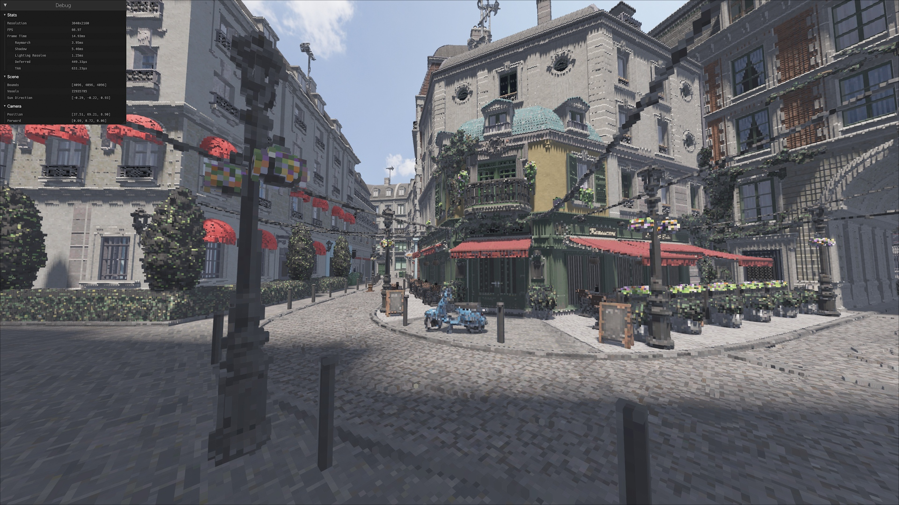
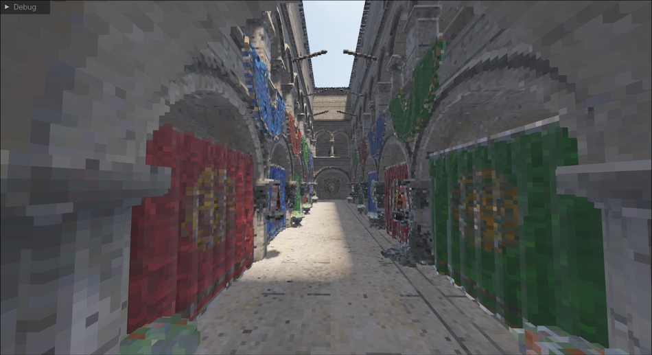
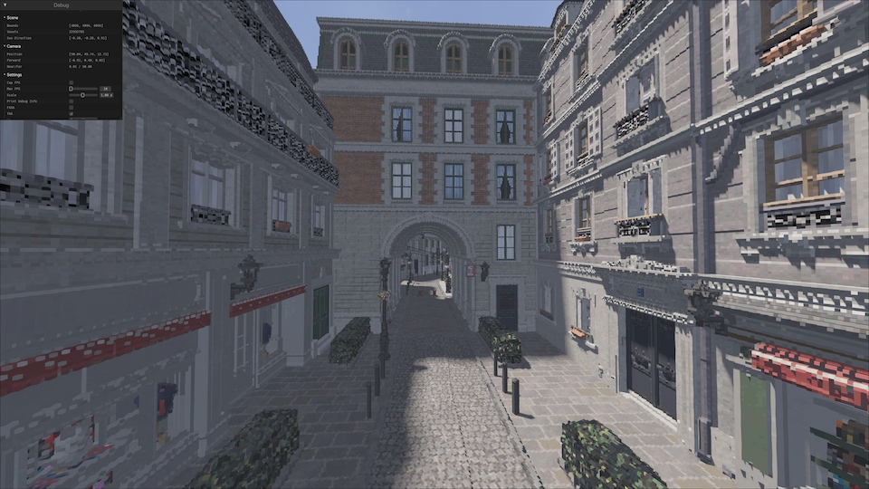

### Voxel raymarching with Rust and WGPU

A personal project of mine on an optimized voxel raymarcher.

Not AI slop.

Includes my own Gltf parser, voxel generation, using sparse 4x4x4 trees for traversal.

More docs to come. I broke my GI and specular reflections when updating the tree structure, so bear with the not-so-pretty lighting model for now.

Raymarching ~20,000,000 voxels in the Amazon Lumberyard Bistro scene at 1080p takes ~0.6-0.85ms on my RTX 3080. I'll make some real benchmarks once everything is ironed out.

I will likely mess around with some lighting methods that aren't just stochastic raymarching. Radiance caching with a voxel-specific DDGI might be in the cards.

